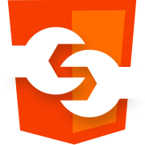

{ data-no-zoom="true" .docspa-logo }

<h2>DocSPA <small><md-env var="version" /></small></h2>

> An Angular-powered documentation SPA

---

[GitHub](https://github.com/swimlane/docspa){ .btn } [Get Started](/#docspa){ .btn .btn-primary }

[[grid]]
| { data-no-zoom="true" } | { data-no-zoom="true" } |
|-|-|
| **Markdown** | **Angular** |
| Focus on your project's documentation, write your docs with Markdown. | Powered by the tools you know, Angular and Angular CLI. Embed live Angular code. |

[[grid]]
| { data-no-zoom="true" } | { data-no-zoom="true" } |
|-|-|
| **Remark plugins** | **Custom elements** |
| Extend markdown using Remark plugins. | Further customize using custom elements.| 