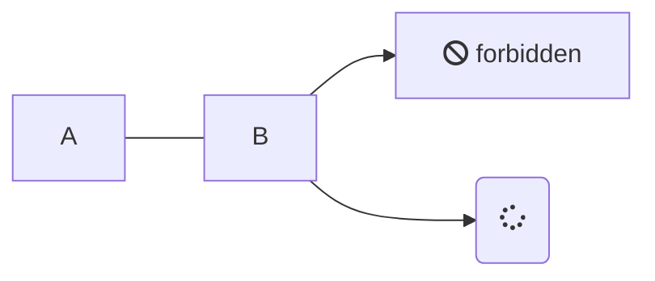
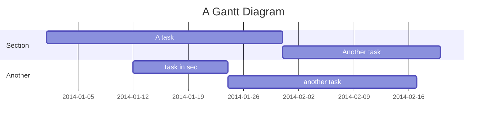
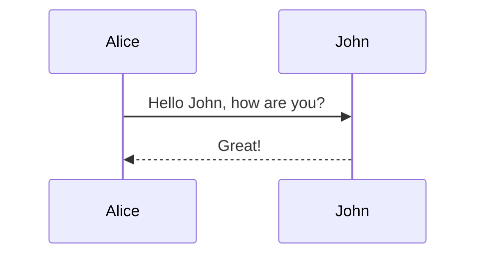

# Content Features

DocSPA uses [remark](https://remark.js.org/) for markdown rendering which by default supports Github Flavored Markdown.

i> See full suite of [markdown here](markdown)

## Github Flavored Markdown

```markdown { playground }
- [ ] foo
- [x] baz
- [ ] bim
- [ ] lim

| Tables        | Are           | Cool  |
| ------------- |:-------------:| -----:|
| col 3 is      | right-aligned | $1600 |
| col 2 is      | centered      |   $12 |
| zebra stripes | are neat      |    $1 |
```

## HTML in Markdown

DocSPA (via remark) supports HTML directly in markdown:

```html { playground }
Acronyms: <abbr title="Three Letter Acronym">TLA</abbr>

<div align="center">
  <iframe
    width="620"
    height="315"
    src="https://www.youtube.com/embed/qfYRSDMghQs">
  </iframe>
</div>

<iframe src="https://embed.plnkr.co/plunk/2eQ9jheOTm8i74vp2EmP?autoCloseSidebar&deferRun&show=preview"
  style="width: 100%; height: 400px;"
  allowfullscreen
  scrolling="no"></iframe>
```

## Markdown Extensions

DocSPA supports [remark plugins](https://github.com/remarkjs/remark/blob/master/doc/plugins.md#list-of-plugins).  Several plugins are activated by default.

i> In DocSPA comes with several default plugins that add features useful for documentation while retaining markdown readability.  Additional plugins can be added and configuraed in the `docspa.config.ts` configuration file.

### YAML Frontmatter

Included in the default plugins is support for yaml frontmatter

```markdown
---
title: Hello
---
```

i> Various parts of DocSPA will display a page title.  By default this page title is the first heading of the page.  This can be overidden by setting the `title` in the YAML Frontmatter.

### Blocks

<small>using [remark-custom-blocks](https://github.com/zestedesavoir/zmarkdown/tree/master/packages/remark-custom-blocks)</small>

```markdown { playground }
[[note | Note]]
| This is a note

[[info | Information]]
| _TODO:_
| unit test

[[tip | *Tip*]]
| *Time* is money,
| my friend!

[[warning | **Watch Out!**]]
| A warning

[[figure | **Figure 1: Figure Title**]]
| 

[[caption | **Table 1: Table Title**]]
| Tables        | Are           | Cool  |
| ------------- |:-------------:| -----:|
| col 3 is      | right-aligned | $1600 |
| col 2 is      | centered      |   $12 |
| zebra stripes | are neat      |    $1 |
```

i> The styles of these elements can be customized using CSS.  Additional custom blocks can be added by adding and configuring `remark-custom-blocks` in `docspa.config.ts`.

### Notices

<small>using [remark-custom-blockquotes](https://github.com/montogeek/remark-custom-blockquotes)</small>

```markdown { playground }
> This is a normal blockquote,
> nothing to see here!

i> _TODO:_
i> unit test

!> *Time* is money,
!> my friend!

?> **Watch Out!** A warning
```

i> The styles of these elements can be customized using CSS.  Additional notices can be added by adding and customizing `remark-custom-blockquotes` in `docspa.config.ts`.

### Code highlight

DocSPA uses [Prism](https://prismjs.com/) for syntax highlighting.

```javascript
(function () {
  console.log('Hello');
})();
```

```html
<b>hello</b>
```

```markdown
*Hello*
```

Including extenstions for line numbers and line highlights.

~~~markdown { playground }
```javascript { .linenos mark="13-27" }
const config = {
  name: 'DocSPA',
  basePath: 'docs/',
  homepage: 'README.md',
  notFoundPage: '_404.md',
  sideLoad: [
    '_sidebar.md',
    '_navbar.md',
    '_right_sidebar.md',
    '_footer.md'
  ],
  coverpage: '_coverpage.md',
  plugins: [
    mermaidHook,
    tabsHook
  ],
  remarkPlugins: [
    ...defaultRemarkPlugins,
    mermaid,
    prism
  ],
  runtimeModules: [
    CommonModule,
    NgxChartsModule,
    BrowserAnimationsModule
  ],
  environment,
  theme: {
    '--theme-color': '#0089FF',
    '--theme-color-secondary-light': '#0074d92e'
  }
};
```
~~~

### Mermaid

~~~markdown { playground }





~~~

i> See [mermaid docs](https://mermaidjs.github.io/) for more details on the supported syntax.

### Math

<small>using [remark-math](https://github.com/Rokt33r/remark-math)</small>

```markdown { playground }
$$
E^2=(mc^2)^2+(pc)^2
$$
```

### Emoji

<small>using [remark-gemoji-to-emoji](https://github.com/jackycute/remark-gemoji-to-emoji) and [remark-html-emoji-image](https://github.com/jackycute/remark-html-emoji-image)</small>

```markdown { playground }
:100: :8ball: :100:
```

## Markdown Attributes

The default remark plugins include [remark-attr](https://github.com/arobase-che/remark-attr) which allows adding ids, styles, classes, and other atributes to markdown elements.

### IDs

The slug for a header can be set by adding an id.

```markdown
## Heading Number Two
{ #number-2 }
```

### Styles

```markdown { playground }
*Doc*{style="color:red; font-size: large"}*SPA*{style="color:blue"}

{ style="border: 10px solid lightgrey; padding: 10px;"}
```

### Classes

```markdown { playground }
<span class="badge note">note</span>
<span class="badge info">info</span>
<span class="badge tip" title="This is a tip">tip</span>
<span class="badge warn" title="Watch out!!">warn</span>

`note`{ .badge .note }
*info*{ .badge .info }
**tip**{ .badge .tip title="This is a tip" }
**warn**{ .badge .warn title="Watch out!!" }
```

[[ badge class="badge note" ]]

### Attributes

```markdown { playground }
{ width="30px" data-no-zoom }

[www.swimlane.com](http://www.swimlane.com){ target="_blank" }
```

## Custom Elements

DocSPA supports custom elements (part of the [web components](https://developer.mozilla.org/en-US/docs/Web/Web_Components) suite of technologies).  Once a custom component is loaded they may be embedded directly into the markdown.

i> Custom elements can be defined using `window.customElements.define` or from [angular elements](https://angular.io/guide/elements).  Many custom elements are also defined a short codes as noted below.

### `md-toc`

The `md-toc` is used to include the table of contents for a give path.

```markdown { playground }
<md-toc path="features" max-depth="2"></md-toc>
```

i> The path is always relative to the root docs folder.  Including `md-toc` without a path will load the TOC for the current page (main content).  `[[toc path="features" max-depth="2"]]` the same as the example above, however, using the shortcode `[[toc]]` (without a path) will insert TOC for the page the shortcodes is found in.

### `md-embed`

```markdown { playground }
<md-embed path="embed"></md-embed>
```

i> `[[include path="embed"]]` the same as the example above.

### `env-var`

The `env-var` component allows displaying variables defined in the `environment` property of the config file.

```markdown { playground }
DocSPA version: <env-var var="version"></env-var>
```

!> `[[var var="version"]]` the same as the example above with the exception that short-codes are block elements.  It is usally expected that `environment` property will contain the contents of your project's `environment.ts`.  `ng build ---prod` replaces `environment.ts` with `environment.prod.ts`.  The list of file replacements can be found in `angular.json`.

### `runtime-content`

A `runtime-content` component allows embedding Angular template content into the markdown.

The run time component can be added as HTML into the markdown file:

```markdown { playground }
<runtime-content context='{ "name": "World" }'>
Hello, {{name}}.
</runtime-content>
```

Or by adding `{ run }` to `HTML` fenced code:

~~~markdown { playground }
```html { run context='{ "count": 0 }' }
<button (click)="count = count + 1">Click me: {{count}}</button>
```
~~~

Use `{ playground }` to create a section containing both the code and the runtime result:

```html { playground context='{"data": [{"name":"Germany","value": 8940000},{"name":"USA","value":5000000},{"name":"France","value":7200000}]}' }
<div style="width: 100%; height: 200px">
  <ngx-charts-bar-vertical
    [legend]="true"
    [xAxis]="true"
    [yAxis]="true"
    [results]="data">
  </ngx-charts-bar-vertical>
</div>
<pre>
{{data | json}}
</pre>
```

i> The components available within a runtime element are controlled by the `runtimeModules` array in the `docspa.config.ts` configuration file.  These modules must also be added to your root app module.

### `embed-stackblitz`

The `embed-stackblitz` component may be used to embed StackBlitz projects within documentation.  The `embed-stackblitz` component accepts a [StackBlitz project payload](https://stackblitz.com/docs#project-payload) as the `project` input.

```markdown { playground }
<embed-stackblitz
  title='Embeded StackBlitz Project<br />DocSPA'
  project='{"template": "javascript", "files": {"index.js": "console.log(123)", "index.html": "Hello World"} }'>
</embed-stackblitz>
```

i> You may also use the `[[stackblitz]]` short-code.

or a path to a project payload (`JSON` file) in the documentation local files (relative to the document root folder):

```markdown { playground }
<embed-stackblitz
  title='Local StackBlitz Project<br />DocSPA'
  project-path="examples/folder/stackblitz">
</embed-stackblitz>
```

i> When providing a payload path, if the `files` property of the payload contains an array, this is treated as an array of relative paths from which the file content will be loaded.

You may also supply a `project-id` to to load an existing StackBlitz project:

```markdown { playground }
<embed-stackblitz
  title='Existing StackBlitz Project<br />DocSPA'
  project-id="sdk-create-project">
</embed-stackblitz>
```

If a both `project-id` and either a `project-path` or `project` input are provided, the files listed in the local project's files are treated as a a patch to the existing StackBlitz project.

```markdown { playground }
<embed-stackblitz
  title='Existing StackBlitz Project with local changes<br />DocSPA'
  project-id="sdk-create-project"
  project-path="examples/folder/stackblitz">
</embed-stackblitz>
```

## *docsify* Plugins

DocSPA supports many [docsify plugins](https://docsify.js.org/#/plugins).  To use a docsify plugin include the `<script>` tag in your `index.html` just like you would when running docsify.

!> Not all docsify plugins are supported and in general it is preferred to use remark plugins or custom elements.

### Zoom Image

<small>import `//unpkg.com/docsify/lib/plugins/zoom-image.min.js`</small>

```markdown { playground }

```

i> Add the `data-no-zoom` attribute to exclude an image `{ data-no-zoom="true" }`

### Copy Code

<small>import [docsify-copy-code](https://github.com/jperasmus/docsify-copy-code)</small>

```js
<script src="//unpkg.com/docsify-copy-code"></script>
```

### Edit on Github

<small>import [docsify-edit-on-github](https://github.com/njleonzhang/docsify-edit-on-github)</small>
