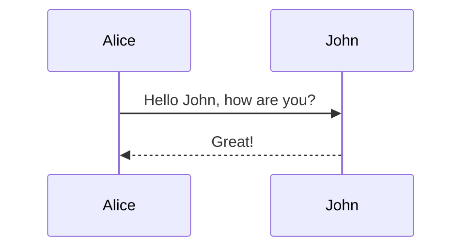
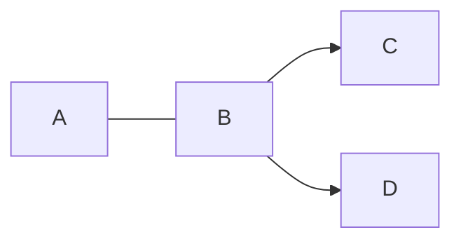

# Content Features

In the [modules](/modules) section several required, recommended, and option modules are described in detail.  Below we summarize features available in if all modulesa re installed as as shown in the [quick start](/quickstart).

## Github Flavored Markdown

DocSPA uses [remark](https://remark.js.org/) for markdown rendering which by default supports Github Flavored Markdown.

i> See full suite of [markdown here](markdown)

```markdown { playground }
- [ ] foo
- [x] baz
- [ ] bim
- [ ] lim

| Tables        | Are           | Cool  |
| ------------- |:-------------:| -----:|
| col 3 is      | right-aligned | $1600 |
| col 2 is      | centered      |   $12 |
| zebra stripes | are neat      |    $1 |
```

## HTML in Markdown

DocSPA (via remark) supports HTML directly in markdown:

```html { playground }
Acronyms: <abbr title="Three Letter Acronym">TLA</abbr>

<div align="center">
  <iframe
    width="620"
    height="315"
    class="embed-youtube"
    src="https://www.youtube.com/embed/qfYRSDMghQs">
  </iframe>
</div>
```

## YAML Frontmatter

Included in the default plugins is support for yaml frontmatter.  This frontmatter is option and may be used for various features.

```markdown
---
title: Hello
keywords: World
---
```

i> Various parts of DocSPA will display a page title.  By default this page title is the first heading of the page.  This can be overidden by setting the `title` in the YAML Frontmatter.

## Blocks and Notices

```markdown { playground }
[[note | Note]]
| This is a note

[[info | Information]]
| _TODO:_
| unit test

[[tip | *Tip*]]
| *Time* is money,
| my friend!

[[warning | **Watch Out!**]]
| A warning

[[figure | **Figure 1: Figure Title**]]
| { width="200" }

[[caption | **Table 1: Table Title**]]
| Tables        | Are           | Cool  |
| ------------- |:-------------:| -----:|
| col 3 is      | right-aligned | $1600 |
| col 2 is      | centered      |   $12 |
| zebra stripes | are neat      |    $1 |
```

```markdown { playground }
+> _TODO:_
+> unit test

i> _TODO:_
i> unit test

!> *Time* is money,
!> my friend!

!!> **Watch Out!** A warning
```

## Code

DocSPA uses [Prism](https://prismjs.com/) for syntax highlighting; including extenstions for line numbers and line highlights.

~~~markdown { playground }
```js { mark="3,14" .linenos }
import { BrowserModule } from '@angular/platform-browser';
import { NgModule } from '@angular/core';
import { DocspaCoreModule } from '@swimlane/docspa-core';

import { AppComponent } from './app.component';
import { config } from '../docspa.config';

@NgModule({
  declarations: [
    AppComponent
  ],
  imports: [
    BrowserModule,
    DocspaCoreModule.forRoot(config)
  ],
  providers: [],
  bootstrap: [AppComponent]
})
export class AppModule { }
```
~~~

## Mermaid

~~~markdown { playground }



~~~

i> See [mermaid docs](https://mermaidjs.github.io/) for more details on the supported syntax.

## Math

```markdown { playground }
$$
E^2=(mc^2)^2+(pc)^2
$$
```

## Emoji

```markdown { playground }
:100: :8ball: :100:
```

## Markdown Attributes

DocSPA supports (via [remark-attr](https://github.com/arobase-che/remark-attr)) adding ids, styles, classes, and other atributes to markdown elements.

### IDs

The slug for a header can be set by adding an id.

```markdown
## Heading Number Two
{ #number-2 }
```

### Styles

```markdown { playground }
*Doc*{style="color:red; font-size: large"}*SPA*{style="color:blue"}

{ style="width: 100px; border: 10px solid lightgrey; padding: 10px;"}
```

### Classes

```markdown { playground }
`note`{ .badge .note }
*info*{ .badge .info }
**tip**{ .badge .tip title="This is a tip" }
**warn**{ .badge .warn title="Watch out!!" }
```

### Attributes

```markdown { playground }
{ width="30px" data-no-zoom }

[www.swimlane.com](http://www.swimlane.com){ target="_blank" }

[ignore](./docs/README.md){ ignore }
```

## Zoom Image

```markdown { playground }
{ width="200px" }
```

i> Add the `data-no-zoom` attribute to exclude an image `{ data-no-zoom="true" }`

## Copy Code

<small>import [docsify-copy-code](https://github.com/jperasmus/docsify-copy-code)</small>

```js
<script src="//unpkg.com/docsify-copy-code"></script>
```


## Table of Contents

Use `[[toc]]` to include the table of contents for a give path.

```markdown { playground }
[[toc path="features" max-depth="2"]]
```

i> The path is always relative to the root docs folder.  Including `md-toc` without a path will load the TOC for the current page (main content).  Using the shortcode `[[toc]]` without a path will insert TOC for the page the shortcodes is found in.

## Include

Use `[[include]]` shortcode to include other files within markdown.

```markdown { playground }
[[include path="/embed.md"]]
```

Add a `codeblock` to include the file as a code block.

```markdown { playground }
[[include path="/embed.js" codeblock='js { mark="2" }']]
```

## Environment Variables

Use the `[[env]]` shortcode to display variables defined in the `environment` property of the config file.

```markdown { playground }
[[env var="version"]]
Production? <md-env var="production" />
```


