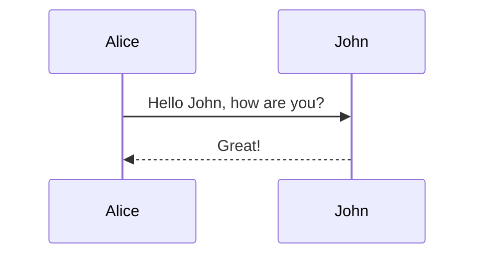
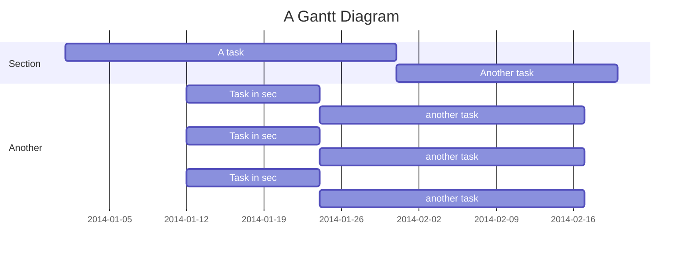
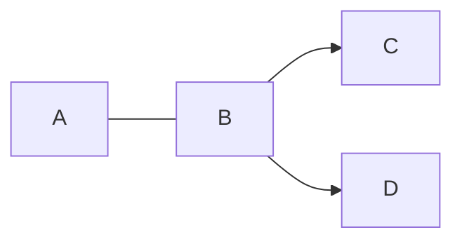

# Modules

The primary method for extending a DocSPA application is via [Angular modules](https://angular.io/guide/architecture-modules).  These modules should be imported to your application's root `NgModule`.  Often a module requires using the `forRoot` static method and supplying additional configuration information.

## DocspaCoreModule

<small>(required)</small>

This module includes the core services and components required by DocSPA.  This module is required and should be imported using the `forRoot()` static method and providing a `config` object described below.

```js { mark="3,14" }
import { BrowserModule } from '@angular/platform-browser';
import { NgModule } from '@angular/core';
import { DocspaCoreModule } from '@swimlane/docspa-core';

import { AppComponent } from './app.component';
import { config } from '../docspa.config';

@NgModule({
  declarations: [
    AppComponent
  ],
  imports: [
    BrowserModule,
    DocspaCoreModule.forRoot(config)
  ],
  providers: [],
  bootstrap: [AppComponent]
})
export class AppModule { }
```

DocSPA settings are derived from the following sources in order of least to highest priority:

- `SetttingService`
- `window.$docsify`
- `DocspaCoreModule.forRoot(config)`

Here is a basic DocSPA config with notes:

```json
{
  "basePath": "docs/",              // Where the markdown files are located
  "homepage": "README.md",          // Default page to load when navigating to a directrory
  "sideLoad": [                     // Additional content load (can be set to false)
    "_sidebar.md",
    "_navbar.md",
    "_right_sidebar.md",
    "_footer.md"
  ],
  "coverpage": "_coverpage.md"     // Coverpage to load (can be set to false)
};
```

i> In the [quick start](../quickstart) setup the config file is located at `src/docspa.config.ts`.  The location and filename is arbitrary but must be imported and used as a parameter for the `DocspaCoreModule.forRoot()` method.

## MarkdownModule

<small>(recommended)</small>

DocSPA utilizes [remark](https://remark.js.org/) for markdown parsing and, thereby, supports [remark plugins](https://github.com/remarkjs/remark/blob/master/doc/plugins.md#list-of-plugins). To include remark plugins add the `MarkdownModule` module.  The config for the `MarkdownModule` is a [unified preset](https://github.com/unifiedjs/unified#preset) with an additional property for a reporter (for example [vfile-reporter](https://github.com/vfile/vfile-reporter)).

```js { mark="3-5,16,19" }
import { BrowserModule } from '@angular/platform-browser';
import { NgModule } from '@angular/core';
import { DocspaCoreModule, MarkdownModule } from '@swimlane/docspa-core';
import { preset } from '@swimlane/docspa-remark-preset';

import { AppComponent } from './app.component';
import { config } from '../docspa.config';

@NgModule({
  declarations: [
    AppComponent
  ],
  imports: [
    BrowserModule,
    DocspaCoreModule.forRoot(config),
    MarkdownModule.forRoot(preset) // preset can be set here, or below for AOT
  ],
  providers: [
    // { provide: MARKDOWN_CONFIG_TOKEN, useFactory: () => preset } // use this for AOT
  ],
  bootstrap: [AppComponent]
})
export class AppModule { }
```

### Settings

#### Github Flavored Markdown

```markdown { playground }
- [ ] foo
- [x] baz
- [ ] bim
- [ ] lim

| Tables        | Are           | Cool  |
| ------------- |:-------------:| -----:|
| col 3 is      | right-aligned | $1600 |
| col 2 is      | centered      |   $12 |
| zebra stripes | are neat      |    $1 |
```

#### HTML in Markdown

DocSPA (via remark) supports HTML directly in markdown:

```html { playground }
Acronyms: <abbr title="Three Letter Acronym">TLA</abbr>

<div align="center">
  <iframe
    width="620"
    height="315"
    class="embed-youtube"
    src="https://www.youtube.com/embed/qfYRSDMghQs">
  </iframe>
</div>
```

### Remark Plugins

#### YAML Frontmatter

Included in the default plugins is support for yaml frontmatter

```markdown
---
title: Hello
---
```

i> Various parts of DocSPA will display a page title.  By default this page title is the first heading of the page.  This can be overidden by setting the `title` in the YAML Frontmatter.

#### Blocks

<small>using [remark-custom-blocks](https://github.com/zestedesavoir/zmarkdown/tree/master/packages/remark-custom-blocks)</small>

```markdown { playground }
[[note | Note]]
| This is a note

[[info | Information]]
| _TODO:_
| unit test

[[tip | *Tip*]]
| *Time* is money,
| my friend!

[[warning | **Watch Out!**]]
| A warning

[[figure | **Figure 1: Figure Title**]]
| 

[[caption | **Table 1: Table Title**]]
| Tables        | Are           | Cool  |
| ------------- |:-------------:| -----:|
| col 3 is      | right-aligned | $1600 |
| col 2 is      | centered      |   $12 |
| zebra stripes | are neat      |    $1 |
```

i> The styles of these elements can be customized using CSS.  Additional custom blocks can be added by adding and configuring `remark-custom-blocks`.

#### Notices

<small>using [remark-custom-blockquotes](https://github.com/montogeek/remark-custom-blockquotes)</small>

```markdown { playground }
> This is a normal blockquote,
> nothing to see here!

i> _TODO:_
i> unit test

!> *Time* is money,
!> my friend!

?> **Watch Out!** A warning
```

i> The styles of these elements can be customized using CSS.  Additional notices can be added by adding and customizing `remark-custom-blockquotes`.

#### Code highlight

DocSPA uses [Prism](https://prismjs.com/) for syntax highlighting.

```javascript
(function () {
  console.log('Hello');
})();
```

```html
<b>hello</b>
```

```markdown
*Hello*
```

Including extensions for line numbers and line highlights.

~~~markdown { playground }
```javascript { .linenos mark="13-27" }
const config = {
  name: 'DocSPA',
  basePath: 'docs/',
  homepage: 'README.md',
  notFoundPage: '_404.md',
  sideLoad: [
    '_sidebar.md',
    '_navbar.md',
    '_right_sidebar.md',
    '_footer.md'
  ],
  coverpage: '_coverpage.md',
  plugins: [
    mermaidHook,
    tabsHook
  ]
};
```
~~~

#### Mermaid

~~~markdown { playground }






~~~

i> See [mermaid docs](https://mermaidjs.github.io/) for more details on the supported syntax.

#### Math

<small>using [remark-math](https://github.com/Rokt33r/remark-math)</small>

```markdown { playground }
$$
E^2=(mc^2)^2+(pc)^2
$$
```

#### Emoji

<small>using [remark-gemoji-to-emoji](https://github.com/jackycute/remark-gemoji-to-emoji) and [remark-html-emoji-image](https://github.com/jackycute/remark-html-emoji-image)</small>

```markdown { playground }
:100: :8ball: :100:
```

#### Markdown Attributes

The default remark plugins include [remark-attr](https://github.com/arobase-che/remark-attr) which allows adding ids, styles, classes, and other atributes to markdown elements.

##### IDs

The slug for a header can be set by adding an id.

```markdown
## Heading Number Two
{ #number-2 }
```

##### Styles

```markdown { playground }
*Doc*{style="color:red; font-size: large"}*SPA*{style="color:blue"}

{ style="width: 200px; border: 10px solid lightgrey; padding: 10px;"}
```

##### Classes

```markdown { playground }
<span class="badge note">note</span>
<span class="badge info">info</span>
<span class="badge tip" title="This is a tip">tip</span>
<span class="badge warn" title="Watch out!!">warn</span>

`note`{ .badge .note }
*info*{ .badge .info }
**tip**{ .badge .tip title="This is a tip" }
**warn**{ .badge .warn title="Watch out!!" }
```

##### Attributes

```markdown { playground }
{ width="30px" data-no-zoom }

[www.swimlane.com](http://www.swimlane.com){ target="_blank" }

[ignore](./docs/README.md){ ignore }
```

## MarkdownElementsModule

<small>(recommended)</small>

DocSPA was designed to work with custom elements (part of the [web components](https://developer.mozilla.org/en-US/docs/Web/Web_Components) suite of technologies).  Once a custom component is loaded they may be embedded directly into the markdown.

i> Custom elements can be defined using `window.customElements.define` or using [angular elements](https://angular.io/guide/elements).

This module provides several core angular componets for DocSPA and is already imported by the `DocspaCoreModule` module.  Including this module in your root application module (using `forRoot`) will also make these angular componets available in markdown as custom elements.  Without this module these custom elements are not available for use within markdown.  Many custom elements are also defined and aliased to short codes as noted below.

```js { mark="3,15" }
import { BrowserModule } from '@angular/platform-browser';
import { NgModule } from '@angular/core';
import { DocspaCoreModule, MarkdownElementsModule } from '@swimlane/docspa-core';
import { preset } from '@swimlane/docspa-remark-preset';

import { AppComponent } from './app.component';
import { config } from '../docspa.config';

@NgModule({
  declarations: [
    AppComponent
  ],
  imports: [
    BrowserModule,
    DocspaCoreModule.forRoot(config),
    MarkdownElementsModule.forRoot()
  ],
  providers: [],
  bootstrap: [AppComponent]
})
export class AppModule { }
```

### Table of Contents

Custom element: `<md-toc>`  
Shortcode: `[[toc]]`

Used to include the table of contents for a give path.

```markdown { playground }
[[toc path="features" max-depth="2"]]
```

i> The path is always relative to the root docs folder.  Including `md-toc` without a path will load the TOC for the current page (main content).  Using the shortcode `[[toc]]` without a path will insert TOC for the page the shortcodes is found in.

### Include

Custom element: `<md-include>`  
Shortcode: `[[include]]`

This shortcode allows including other files within markdown.

```markdown { playground }
[[include path="/examples/embed.md"]]
```

including code blocks:

```markdown { playground }
[[include path="/examples/embed.js" codeblock="js"]]
```

### Environment Variables

Custom element: `<env>`  
Shortcode: `[[env]]`

This shortcode allows displaying variables defined in the "environment" property.

```markdown { playground }
[[env var="version"]]
Production? <env var="production" />
```

!> It is usally expected that `environment` property will contain the contents of your project's `environment.ts`.  `ng build ---prod` replaces `environment.ts` with `environment.prod.ts`.  The list of file replacements can be found in `angular.json`.


## DocsifyPluginsModule

<small>(optional)</small>

DocSPA supports many (but not all) [docsify plugins](https://docsify.js.org/#/plugins?id=list-of-plugins).  To include docsify plugins add the `DocsifyPluginsModule` and a global `$docsify` and include plugin `<script>` tags in your `index.html` just like you would when running docsify.  This module will load docsify plugins and attach them to internal DocSPA hooks.

!> Not all docsify plugins are supported and in general it is preferred to use remark plugins or custom elements.

```html
<script>
  // support $docsify plugins
  window.$docsify = { plugins: [] };
</script>
<script src="//unpkg.com/docsify@4/lib/plugins/zoom-image.min.js"></script>
<script src="//unpkg.com/docsify-copy-code@2"></script>
<script src="https://cdn.jsdelivr.net/npm/katex@0.10.0-beta/dist/katex.min.js"></script>
<script src="https://cdn.polyfill.io/v2/polyfill.min.js"></script>
```

```js { mark="3,15" }
import { BrowserModule } from '@angular/platform-browser';
import { NgModule } from '@angular/core';
import { DocspaCoreModule, DocsifyPluginsModule } from '@swimlane/docspa-core';

import { AppComponent } from './app.component';
import { config } from '../docspa.config';

@NgModule({
  declarations: [
    AppComponent
  ],
  imports: [
    BrowserModule,
    DocspaCoreModule.forRoot(config),
    DocsifyPluginsModule
  ],
  providers: [],
  bootstrap: [AppComponent]
})
export class AppModule { }
```

Some supported docsify plugins include:

### Zoom Image

```html
<script src="//unpkg.com/docsify@4/lib/plugins/zoom-image.min.js"></script>
```

```markdown { playground }

```

i> Add the `data-no-zoom` attribute to exclude an image `{ data-no-zoom="true" }`

### Copy Code

```html
<script src="//unpkg.com/docsify-copy-code@2"></script>
```

### Edit on Github

```html
<script src="//unpkg.com/docsify-edit-on-github@1.0.1/index.js"></script>
<script>
  window.$docsify = { 
    plugins: [
      EditOnGithubPlugin.create('https://github.com/swimlane/docspa/blob/master/src/docs/', null, '✎ Edit this page')
    ]
  };
</script>
```

## RuntimeContentModule

<small>(optional)</small>

This module enables embedding runtime Angular templates in markdown content.  As config it requires a list of Angular modules available to the runtime component.

!> This module is not compatible with AOT.

```js { mark="3,15-21" }
import { BrowserModule } from '@angular/platform-browser';
import { NgModule } from '@angular/core';
import { DocspaCoreModule, RuntimeContentModule } from '@swimlane/docspa-core';

import { AppComponent } from './app.component';
import { config } from '../docspa.config';

@NgModule({
  declarations: [
    AppComponent
  ],
  imports: [
    BrowserModule,
    DocspaCoreModule.forRoot(config),
    RuntimeContentModule.forRoot({
      imports: [
        CommonModule,
        NgxChartsModule,
        BrowserAnimationsModule
      ]
    })
  ],
  providers: [],
  bootstrap: [AppComponent]
})
export class AppModule { }
```

The `RuntimeContentModule` provides a `runtime-content` custom element that allows embedding Angular template content into markdown.  The `runtime-content` custom element can be added as HTML into the markdown file:

```markdown { playground }
<runtime-content context='{ "name": "World" }'>
Hello, {{name}}.
</runtime-content>
```

Or by adding `{ run }` to `HTML` fenced code:

~~~markdown { playground }
```html { run context='{ "count": 0 }' }
<button (click)="count = count + 1">Click me: {{count}}</button>
```
~~~

Use `{ playground }` to create a section containing both the code and the runtime result:

```html { playground context='{"data": [{"name":"Germany","value": 8940000},{"name":"USA","value":5000000},{"name":"France","value":7200000}]}' }
<div style="width: 100%; height: 200px">
  <ngx-charts-bar-vertical
    [legend]="true"
    [xAxis]="true"
    [yAxis]="true"
    [results]="data">
  </ngx-charts-bar-vertical>
</div>
<pre>
{{data | json}}
</pre>
```

i> The angular components available within a runtime custom element are controlled by the `RuntimeContentModule.forRoot({ import: [...]})` `import` array.  These modules must also be added to your root app module.

## DocspaStackblitzModule

<small>(optional, external)</small>

This module allows embedding StackBlitz projects within markdown using a `embed-stackblitz` custom element and the [[stackblitz]] shortcode.

```js { mark="3,15" }
import { BrowserModule } from '@angular/platform-browser';
import { NgModule } from '@angular/core';
import { DocspaCoreModule } from '@swimlane/docspa-core';
import { DocspaStackblitzModule } from '@swimlane/docspa-stackblitz';

import { AppComponent } from './app.component';
import { config } from '../docspa.config';

@NgModule({
  declarations: [
    AppComponent
  ],
  imports: [
    BrowserModule,
    DocspaCoreModule.forRoot(config),
    DocspaStackblitzModule
  ],
  providers: [],
  bootstrap: [AppComponent]
})
export class AppModule { }
```

The `embed-stackblitz` custom element accepts a [StackBlitz project payload](https://stackblitz.com/docs#project-payload) as the `project` input.

```markdown { playground }
<embed-stackblitz
  title='Embeded StackBlitz Project<br />DocSPA'
  project='{"template": "javascript", "files": {"index.js": "console.log(123)", "index.html": "Hello World"} }'>
</embed-stackblitz>
```

or a path to a project payload (`JSON` file) in the documentation local files (relative to the document root folder):

```markdown { playground }
[[stackblitz title="Local StackBlitz Project<br />DocSPA" project-path="examples/folder/stackblitz" ]]
```

i> When providing a payload path, if the `files` property of the payload contains an array, this is treated as an array of relative paths from which the file content will be loaded.

You may also supply a `project-id` to to load an existing StackBlitz project:

```markdown { playground }
<embed-stackblitz
  title='Existing StackBlitz Project<br />DocSPA'
  project-id="sdk-create-project">
</embed-stackblitz>
```

If a both `project-id` and either a `project-path` or `project` input are provided, the files listed in the local project's files are treated as a a patch to the existing StackBlitz project.

```markdown { playground }
<embed-stackblitz
  title='Existing StackBlitz Project with local changes<br />DocSPA'
  project-id="sdk-create-project"
  project-path="examples/folder/stackblitz">
</embed-stackblitz>
```


